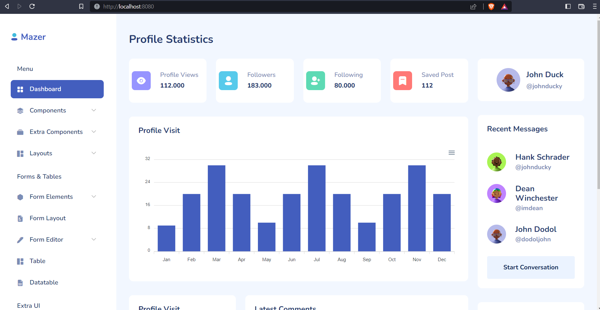

# Read Me First
The following was discovered as part of building this project:

# Getting Started

### Reference Documentation
For further reference, please consider the following sections:

* [Official Apache Maven documentation](https://maven.apache.org/guides/index.html)
* [Spring Boot Maven Plugin Reference Guide](https://docs.spring.io/spring-boot/docs/2.7.9-SNAPSHOT/maven-plugin/reference/html/)
* [Create an OCI image](https://docs.spring.io/spring-boot/docs/2.7.9-SNAPSHOT/maven-plugin/reference/html/#build-image)

# Project Introduction
In this project the template of Mazer, applied in this spring project with Thymeleaf format.
Reference link for Mazer template; 
https://zuramai.github.io/mazer/docs/

- See WebController.java class to render web pages
- HTML pages under resources/templates folder
- assets folder under resources/templates folder

# Thymeleaf Reference
https://www.baeldung.com/thymeleaf-in-spring-mvc

# Version Details
Java 11

Maven

Spring Boot 2.7.9-snapshot

Tomcat WAR Build

# Updates on 29-Sep-2023
Java version updated to 17

Spring Boot version updated to 3.1.4

JAR Build

Mazer Theme version updated to 2.2.0

No .html suffix needed on the URL controller. Removed the .html extension in all pages href. This is the only changes on HTML pages. 
Thymeleaf related tags are not added. 

# Updates on 30-Sep-2023
Docker related settings added,
- Dockerfile added
- docker-compose.yml added
- spring-boot-docker-compose dependency added to pom.xml

# TODO
~~Dockerfile design~~   

# Screenshot
Screnshot

Screenshot v2.2.0

